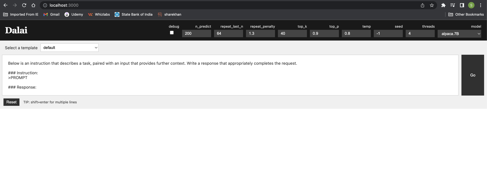
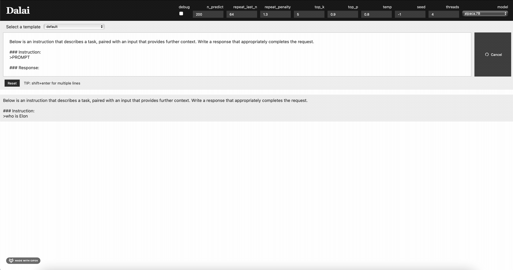

# 🌙 Lunaris AI — Your Offline AI Chat Companion

Lunaris AI is a fully offline, privacy-first AI chat companion built using [Dalai](https://github.com/cocktailpeanut/dalai) and powered by lightweight Large Language Models (LLMs) such as LLaMA and Alpaca. This project transforms your local machine into an intelligent assistant without depending on any external APIs or internet access.

Whether you're a developer, researcher, or privacy enthusiast — Lunaris AI is designed to offer smart conversations completely **locally**, **securely**, and **independently**.

---

## 🌟 Key Features

✨ **100% Offline Chat AI**  
> No data sent to the cloud. Everything runs on your device, giving you complete control.

⚙️ **Dalai Integration**  
> Uses Dalai to run Meta's LLaMA and Stanford's Alpaca models.

💬 **User-Friendly Interface**  
> Clean web UI to interact with the model locally at `localhost:3000`.

🧪 **Customizable Parameters**  
> Control top-k, top-p, temperature, tokens, and more from the UI.

📷 **UI Demo Included**  
> See the real-time interaction and local inference in action.

🔒 **No Dependencies on External APIs**  
> Internet is not required after setup. Truly autonomous.

---

## 📦 Tech Stack

| Component     | Description                                      |
|---------------|--------------------------------------------------|
| **Dalai**     | JS-based tool for running LLaMA and Alpaca       |
| **Node.js**   | Local server for hosting chat UI                 |
| **Alpaca.7B** | Fine-tuned version of Meta’s LLaMA model         |
| **HTML/CSS**  | Frontend rendering of chat interface             |

---

## 🖥️ Installation Guide

> Follow the steps below to set up Lunaris AI on your system.

### 1️⃣ Clone the Repository

```bash
git clone https://github.com/nyhereo-benzai1/lunaris_ai.git
cd lunaris_ai
```

### 2️⃣ Install Dalai

Dalai handles downloading and setting up the required models. It’s a wrapper that simplifies LLaMA/Alpaca installation.

```bash
npx dalai@latest install
```

### 3️⃣ Serve the Application

Start the Dalai server to access the chat UI.

```bash
npx dalai serve
```

### 4️⃣ Open in Browser

Navigate to:

```
http://localhost:3000
```

---

## 🧪 UI & Demo

### 📸 Screenshot

> Preview of the chat interface running locally.



---

### 🎞️ Live Working GIF

> See Lunaris AI responding to real-time queries.



---

## 🧠 Model Information

Currently using:

- **Model:** `alpaca.7B`
- **Inference Engine:** `Dalai`
- **Prompt Template:** Alpaca-style instructions
- **Generation Parameters (UI customizable):**
  - `n_predict`: 200
  - `top_k`: 40
  - `top_p`: 0.8
  - `temp`: 0.8
  - `repeat_penalty`: 1.3

---

## 🛠️ Configuration & Tips

- Use `shift + enter` for multi-line input in the prompt box.
- Toggle parameters for more creative or deterministic results.
- Switch models by modifying Dalai configuration (e.g., llama.7B).
- Use the `"default"` template or customize prompt formats.

---

## 🎯 Future Enhancements

✅ **Short Term:**

- Add memory to retain context across turns  
- Introduce voice-to-text input and text-to-speech output  
- Optimize interface responsiveness and add themes  

🚀 **Long Term:**

- Integrate vector DB for semantic memory  
- LangChain and Agent-based extensions  
- Fully cross-platform packaged desktop app (Electron)

---

## 🤝 Contribution Guidelines

We welcome all contributors! Whether it's fixing bugs, improving the UI, or adding new features — every bit helps 🌱

### How to Contribute:

1. Fork this repo
2. Create a branch: `git checkout -b feature-name`
3. Commit your changes
4. Push and create a PR

---

## 📜 License

This project is licensed under the **MIT License** — you’re free to use, modify, and distribute.

---

## 🙌 Acknowledgements

- 💡 [Meta AI - LLaMA](https://github.com/facebookresearch/llama)
- 🦙 [Stanford Alpaca](https://github.com/tatsu-lab/stanford_alpaca)
- 🍹 [Dalai by @cocktailpeanut](https://github.com/cocktailpeanut/dalai)

---

## 👩‍💻 About the Creator

**Nyx (a.k.a. nyhereo-benzai1)**  
> AI Developer | Innovator | Dreamer  
Building tools that respect your freedom, privacy, and potential.

🌐 GitHub: [@nyhereo-benzai1](https://github.com/nyhereo-benzai1)

---

> “Lunaris AI is a step toward independent intelligence. Let’s shape a future where machines work *with* us — not *on* us.”
